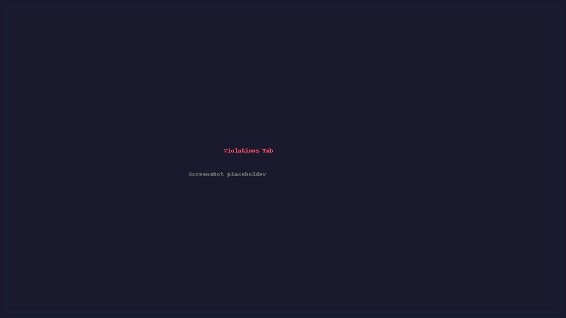
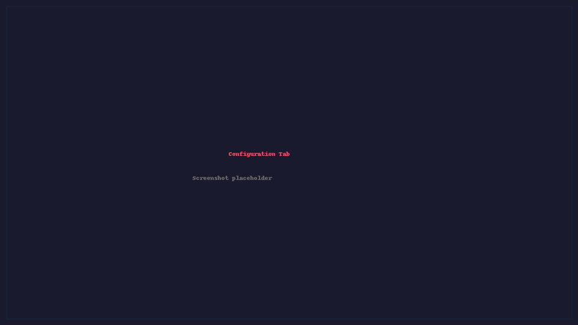

Interactive Console UI
======================

The interactive terminal UI is an optional build-time feature (disabled by
default, since the primary use of sqc is CLI + CI/CD). Build with the ``tui``
feature to enable it:

::

    cargo build --release --features tui

Then launch it with ``--interactive`` (or ``-i``):

::

    sqc /path/to/project --interactive
    sqc /path/to/project -d /path/to/project -i    # with cross-file context

Running ``--interactive`` against a binary built without the ``tui`` feature
exits with an error telling you to rebuild with ``--features tui``.

The UI is built with `ratatui <https://ratatui.rs/>`_ and provides two tabs:
**Violations** and **Configuration**.

.. note::

    Screenshots below show the TUI running in a standard terminal emulator.
    The UI adapts to terminal size and supports 256-color and truecolor terminals.

Violations Tab
--------------

   *Violations tab with violations grouped by file. The right panel shows a
   source preview with the violation line highlighted.*

The Violations tab displays all detected violations with grouping, sorting,
selection, and inline source preview capabilities.

Configuration Tab
-----------------

   *Configuration tab showing CERT C rule categories. Toggle individual rules
   on/off and export custom manifests.*

The Configuration tab lets you browse all 311 rules by category, toggle
them on/off, and export a custom manifest file.

Keyboard Reference
------------------

Navigation (both tabs)
~~~~~~~~~~~~~~~~~~~~~~

==============================  =============================================
Key                             Action
==============================  =============================================
``Up`` / ``Down``               Move up/down one item
``Page Up`` / ``Page Down``     Move up/down by 10 items
``Left`` / ``Right``            Collapse / expand group
``q`` / ``Esc``                 Quit
==============================  =============================================

Tab Switching
~~~~~~~~~~~~~

==============================  =============================================
Key                             Action
==============================  =============================================
``v``                           Switch to Violations tab
``c``                           Switch to Configuration tab
``Tab``                         Toggle focus between violations list and preview
==============================  =============================================

Violations Tab -- Selection
~~~~~~~~~~~~~~~~~~~~~~~~~~~

==============================  =============================================
Key                             Action
==============================  =============================================
``Space``                       Toggle checkbox / expand-collapse group header
``a``                           Select all violations
``Shift+A``                     Select all in current group
``n``                           Deselect all violations
``Shift+N``                     Deselect all in current group
==============================  =============================================

Violations Tab -- Actions
~~~~~~~~~~~~~~~~~~~~~~~~~

==============================  =============================================
Key                             Action
==============================  =============================================
``s``                           Scan repository for violations
``i``                           Suppress checked violations (``.sqc-suppress.toml``)
``e``                           Export checked violations to file (CSV)
``h``                           Toggle suppressed violations and clean files
``p``                           Toggle file preview panel
==============================  =============================================

Violations Tab -- Sorting / Grouping
~~~~~~~~~~~~~~~~~~~~~~~~~~~~~~~~~~~~~

==============================  =============================================
Key                             Action
==============================  =============================================
``1``                           Default sort order
``2``                           Group by violation ID (CERT rule)
``3``                           Group by file path
``4``                           Group by filename
``r``                           Reverse sort direction
==============================  =============================================

Configuration Tab
~~~~~~~~~~~~~~~~~

==============================  =============================================
Key                             Action
==============================  =============================================
``Space``                       Toggle rule enabled/disabled
``e``                           Save configuration to file
``Left`` / ``Right``            Collapse / expand category group
==============================  =============================================
